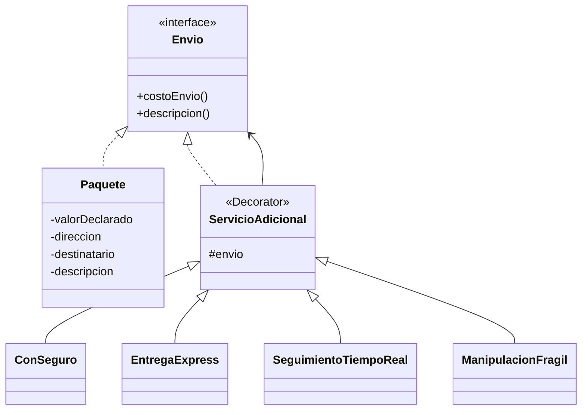

```mermaid
    classDiagram

class Envio{
    <<interface>>
    +costoEnvio()
    +descripcion()
}

class Paquete{
    -valorDeclarado
    -direccion
    -destinatario
    -descripcion
}

class ServicioAdicional{
    <<Decorator>>
    #envio
}

class ConSeguro
class EntregaExpress
class SeguimientoTiempoReal
class ManipulacionFragil

Envio <|.. Paquete

Envio <|.. ServicioAdicional

ServicioAdicional <|-- ConSeguro
ServicioAdicional <|-- EntregaExpress
ServicioAdicional <|-- SeguimientoTiempoReal
ServicioAdicional <|-- ManipulacionFragil

ServicioAdicional --> Envio
```