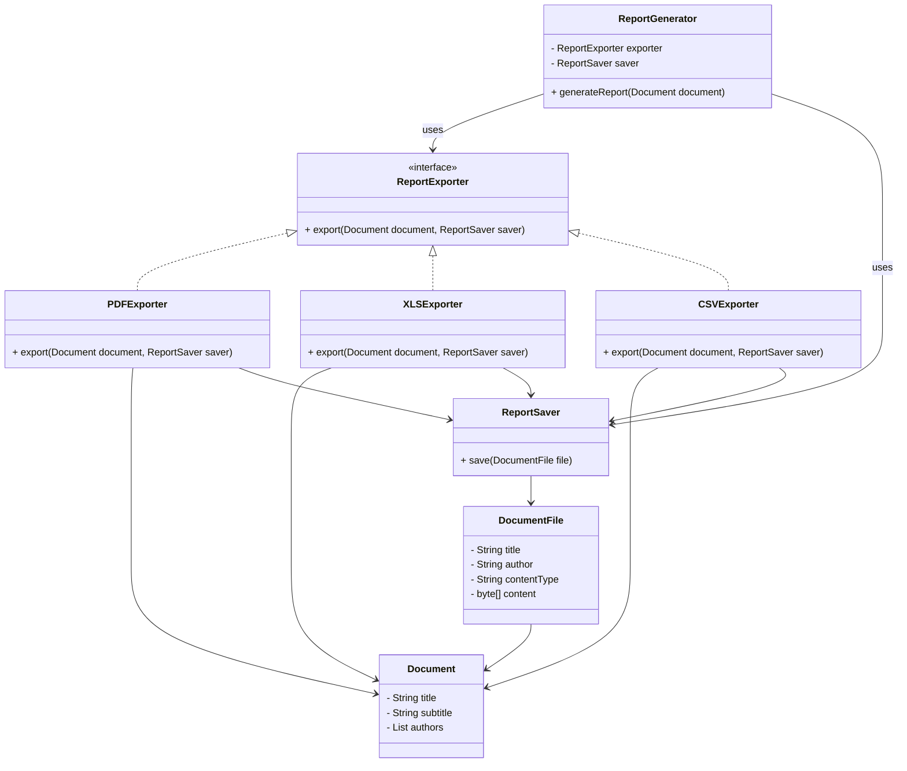

```mermaid
classDiagram

class ReportGenerator {
  - ReportExporter exporter
  - ReportSaver saver
  + generateReport(Document document)
}

class ReportExporter {
  <<interface>>
  + export(Document document, ReportSaver saver)
}

class PDFExporter {
  + export(Document document, ReportSaver saver)
}

class XLSExporter {
  + export(Document document, ReportSaver saver)
}

class CSVExporter {
  + export(Document document, ReportSaver saver)
}

class ReportSaver {
  + save(DocumentFile file)
}

class Document {
  - String title
  - String subtitle
  - List<String> authors
}

class DocumentFile {
  - String title
  - String author
  - String contentType
  - byte[] content
}

ReportGenerator --> ReportExporter : uses
ReportGenerator --> ReportSaver : uses

ReportExporter <|.. PDFExporter
ReportExporter <|.. XLSExporter
ReportExporter <|.. CSVExporter

PDFExporter --> Document
XLSExporter --> Document
CSVExporter --> Document

PDFExporter --> ReportSaver
XLSExporter --> ReportSaver
CSVExporter --> ReportSaver

DocumentFile --> Document
ReportSaver --> DocumentFile
```