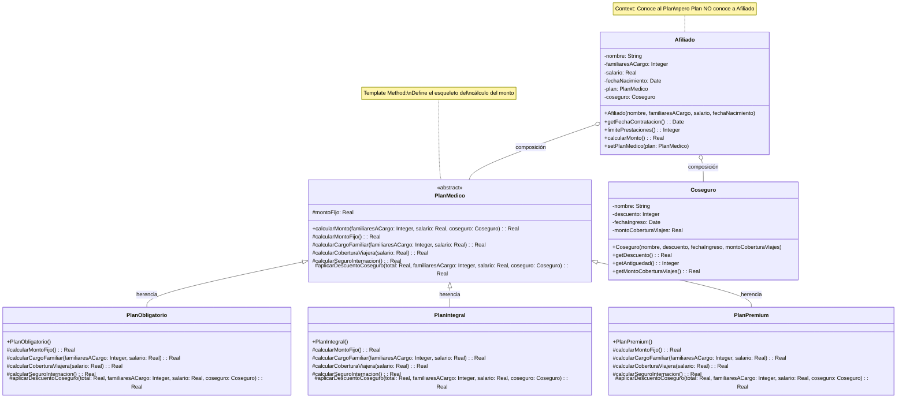

```mermaid
classDiagram
    class Afiliado {
        -nombre: String
        -familiaresACargo: Integer
        -salario: Real
        -fechaNacimiento: Date
        -plan: PlanMedico
        -coseguro: Coseguro
        +Afiliado(nombre, familiaresACargo, salario, fechaNacimiento)
        +getFechaContratacion(): Date
        +limitePrestaciones(): Integer
        +calcularMonto(): Real
        +setPlanMedico(plan: PlanMedico)
    }
    
    class PlanMedico {
        <<abstract>>
        #montoFijo: Real
        +calcularMonto(familiaresACargo: Integer, salario: Real, coseguro: Coseguro): Real
        #calcularMontoFijo(): Real
        #calcularCargoFamiliar(familiaresACargo: Integer, salario: Real): Real
        #calcularCoberturaViajera(salario: Real): Real
        #calcularSeguroInternacion(): Real
        #aplicarDescuentoCoseguro(total: Real, familiaresACargo: Integer, salario: Real, coseguro: Coseguro): Real
    }
    
    class PlanObligatorio {
        +PlanObligatorio()
        #calcularMontoFijo(): Real
        #calcularCargoFamiliar(familiaresACargo: Integer, salario: Real): Real
        #calcularCoberturaViajera(salario: Real): Real
        #calcularSeguroInternacion(): Real
        #aplicarDescuentoCoseguro(total: Real, familiaresACargo: Integer, salario: Real, coseguro: Coseguro): Real
    }
    
    class PlanIntegral {
        +PlanIntegral()
        #calcularMontoFijo(): Real
        #calcularCargoFamiliar(familiaresACargo: Integer, salario: Real): Real
        #calcularCoberturaViajera(salario: Real): Real
        #calcularSeguroInternacion(): Real
        #aplicarDescuentoCoseguro(total: Real, familiaresACargo: Integer, salario: Real, coseguro: Coseguro): Real
    }
    
    class PlanPremium {
        +PlanPremium()
        #calcularMontoFijo(): Real
        #calcularCargoFamiliar(familiaresACargo: Integer, salario: Real): Real
        #calcularCoberturaViajera(salario: Real): Real
        #calcularSeguroInternacion(): Real
        #aplicarDescuentoCoseguro(total: Real, familiaresACargo: Integer, salario: Real, coseguro: Coseguro): Real
    }
    
    class Coseguro {
        -nombre: String
        -descuento: Integer
        -fechaIngreso: Date
        -montoCoberturaViajes: Real
        +Coseguro(nombre, descuento, fechaIngreso, montoCoberturaViajes)
        +getDescuento(): Real
        +getAntiguedad(): Integer
        +getMontoCoberturaViajes(): Real
    }
    
    Afiliado o-- PlanMedico : composición
    Afiliado o-- Coseguro : composición
    PlanMedico <|-- PlanObligatorio : herencia
    PlanMedico <|-- PlanIntegral : herencia
    PlanMedico <|-- PlanPremium : herencia
    
    note for PlanMedico "Template Method:\nDefine el esqueleto del\ncálculo del monto"
    note for Afiliado "Context: Conoce al Plan\npero Plan NO conoce a Afiliado"
```