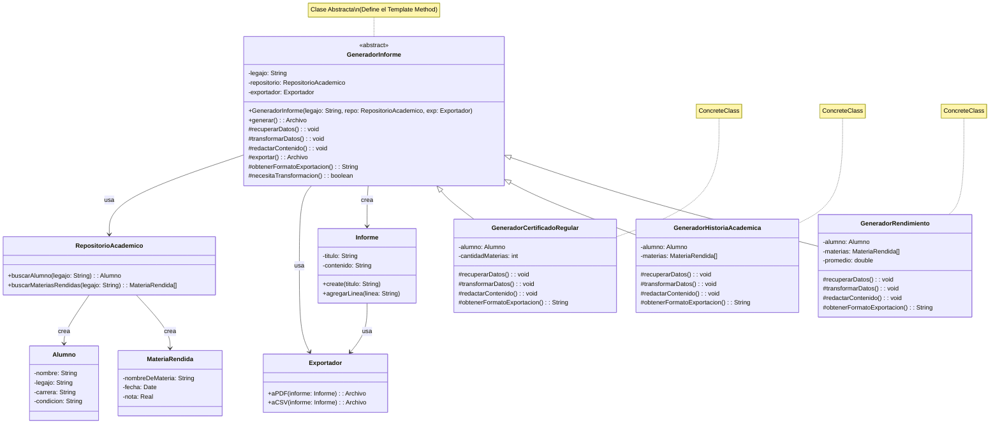

```mermaid
classDiagram
    %% ===== CLASES EXISTENTES =====
    class RepositorioAcademico {
        +buscarAlumno(legajo: String): Alumno
        +buscarMateriasRendidas(legajo: String): MateriaRendida[]
    }

    class Alumno {
        -nombre: String
        -legajo: String
        -carrera: String
        -condicion: String
    }

    class MateriaRendida {
        -nombreDeMateria: String
        -fecha: Date
        -nota: Real
    }

    class Informe {
        -titulo: String
        -contenido: String
        +create(titulo: String)
        +agregarLinea(linea: String)
    }

    class Exportador {
        +aPDF(informe: Informe): Archivo
        +aCSV(informe: Informe): Archivo
    }

    %% ===== NUEVAS CLASES - TEMPLATE METHOD =====
    class GeneradorInforme {
        <<abstract>>
        -legajo: String
        -repositorio: RepositorioAcademico
        -exportador: Exportador
        +GeneradorInforme(legajo: String, repo: RepositorioAcademico, exp: Exportador)
        +generar(): Archivo
        #recuperarDatos(): void
        #transformarDatos(): void
        #redactarContenido(): void
        #exportar(): Archivo
        #obtenerFormatoExportacion(): String
        #necesitaTransformacion(): boolean
    }

    class GeneradorCertificadoRegular {
        -alumno: Alumno
        -cantidadMaterias: int
        #recuperarDatos(): void
        #transformarDatos(): void
        #redactarContenido(): void
        #obtenerFormatoExportacion(): String
    }

    class GeneradorHistoriaAcademica {
        -alumno: Alumno
        -materias: MateriaRendida[]
        #recuperarDatos(): void
        #transformarDatos(): void
        #redactarContenido(): void
        #obtenerFormatoExportacion(): String
    }

    class GeneradorRendimiento {
        -alumno: Alumno
        -materias: MateriaRendida[]
        -promedio: double
        #recuperarDatos(): void
        #transformarDatos(): void
        #redactarContenido(): void
        #obtenerFormatoExportacion(): String
    }

    %% ===== RELACIONES =====
    RepositorioAcademico --> Alumno : crea
    RepositorioAcademico --> MateriaRendida : crea
    Informe --> Exportador : usa
    GeneradorInforme --> RepositorioAcademico : usa
    GeneradorInforme --> Exportador : usa
    GeneradorInforme --> Informe : crea
    
    GeneradorInforme <|-- GeneradorCertificadoRegular
    GeneradorInforme <|-- GeneradorHistoriaAcademica
    GeneradorInforme <|-- GeneradorRendimiento

    %% ===== ROLES =====
    note for GeneradorInforme "Clase Abstracta\n(Define el Template Method)"
    note for GeneradorCertificadoRegular "ConcreteClass"
    note for GeneradorHistoriaAcademica "ConcreteClass"
    note for GeneradorRendimiento "ConcreteClass"

```