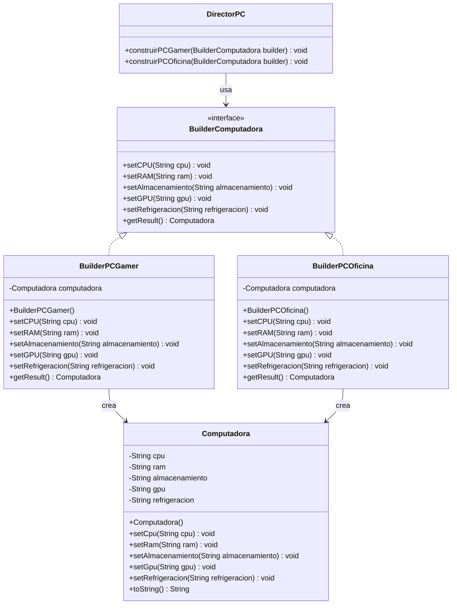

```mermaid
classDiagram
    class Computadora {
        -String cpu
        -String ram
        -String almacenamiento
        -String gpu
        -String refrigeracion
        +Computadora()
        +setCpu(String cpu) void
        +setRam(String ram) void
        +setAlmacenamiento(String almacenamiento) void
        +setGpu(String gpu) void
        +setRefrigeracion(String refrigeracion) void
        +toString() String
    }

    class BuilderComputadora {
        <<interface>>
        +setCPU(String cpu) void
        +setRAM(String ram) void
        +setAlmacenamiento(String almacenamiento) void
        +setGPU(String gpu) void
        +setRefrigeracion(String refrigeracion) void
        +getResult() Computadora
    }

    class BuilderPCGamer {
        -Computadora computadora
        +BuilderPCGamer()
        +setCPU(String cpu) void
        +setRAM(String ram) void
        +setAlmacenamiento(String almacenamiento) void
        +setGPU(String gpu) void
        +setRefrigeracion(String refrigeracion) void
        +getResult() Computadora
    }

    class BuilderPCOficina {
        -Computadora computadora
        +BuilderPCOficina()
        +setCPU(String cpu) void
        +setRAM(String ram) void
        +setAlmacenamiento(String almacenamiento) void
        +setGPU(String gpu) void
        +setRefrigeracion(String refrigeracion) void
        +getResult() Computadora
    }

    class DirectorPC {
        +construirPCGamer(BuilderComputadora builder) void
        +construirPCOficina(BuilderComputadora builder) void
    }

    BuilderComputadora <|.. BuilderPCGamer
    BuilderComputadora <|.. BuilderPCOficina
    DirectorPC --> BuilderComputadora : usa
    BuilderPCGamer --> Computadora : crea
    BuilderPCOficina --> Computadora : crea
```