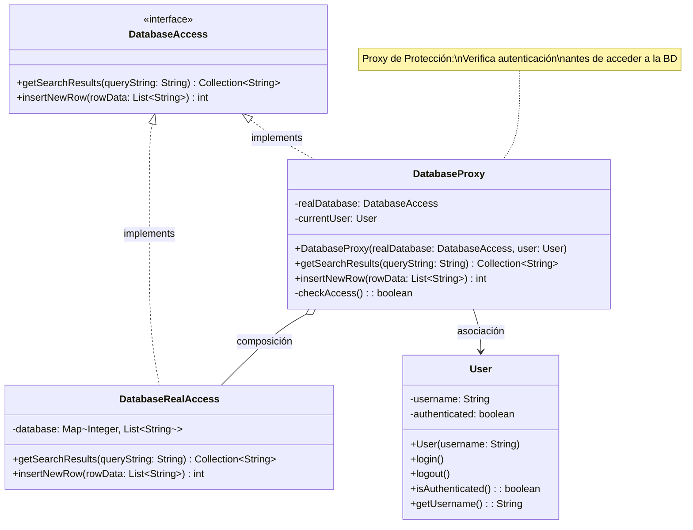

## Acceso a la Base de Datos con proteccion
### Patron Proxy

```mermaid
classDiagram
    class DatabaseAccess {
        <<interface>>
        +getSearchResults(queryString: String) Collection~String~
        +insertNewRow(rowData: List~String~) int
    }
    
    class DatabaseRealAccess {
        -database: Map~Integer, List~String~~
        +getSearchResults(queryString: String) Collection~String~
        +insertNewRow(rowData: List~String~) int
    }
    
    class DatabaseProxy {
        -realDatabase: DatabaseAccess
        -currentUser: User
        +DatabaseProxy(realDatabase: DatabaseAccess, user: User)
        +getSearchResults(queryString: String) Collection~String~
        +insertNewRow(rowData: List~String~) int
        -checkAccess(): boolean
    }
    
    class User {
        -username: String
        -authenticated: boolean
        +User(username: String)
        +login()
        +logout()
        +isAuthenticated(): boolean
        +getUsername(): String
    }
    
    DatabaseAccess <|.. DatabaseRealAccess : implements
    DatabaseAccess <|.. DatabaseProxy : implements
    DatabaseProxy o-- DatabaseRealAccess : composición
    DatabaseProxy --> User : asociación
    
    note for DatabaseProxy "Proxy de Protección:\nVerifica autenticación\nantes de acceder a la BD"
```