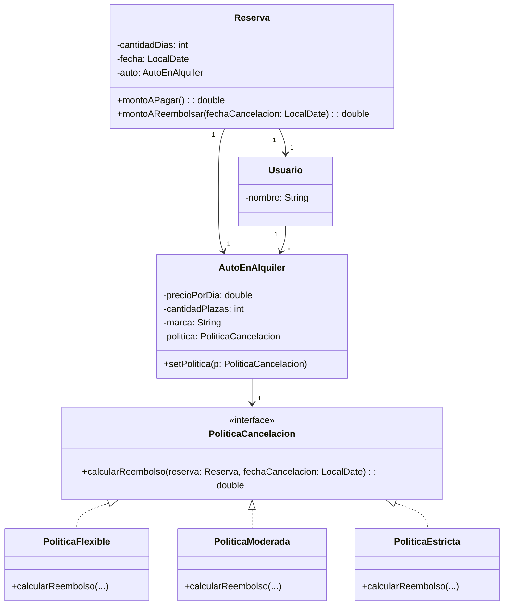

### UML de Alquiler de Automoviles

```mermaid
classDiagram
    class Usuario {
        -nombre: String
    }

    class AutoEnAlquiler {
        -precioPorDia: double
        -cantidadPlazas: int
        -marca: String
        -politica: PoliticaCancelacion
        +setPolitica(p: PoliticaCancelacion)
    }

    class Reserva {
        -cantidadDias: int
        -fecha: LocalDate
        -auto: AutoEnAlquiler
        +montoAPagar(): double
        +montoAReembolsar(fechaCancelacion: LocalDate): double
    }

    class PoliticaCancelacion <<interface>> {
        +calcularReembolso(reserva: Reserva, fechaCancelacion: LocalDate): double
    }

    class PoliticaFlexible {
        +calcularReembolso(...)
    }

    class PoliticaModerada {
        +calcularReembolso(...)
    }

    class PoliticaEstricta {
        +calcularReembolso(...)
    }

    Reserva "1" --> "1" AutoEnAlquiler
    Usuario "1"-->"*" AutoEnAlquiler
    Reserva "1"-->"1" Usuario
    AutoEnAlquiler --> "1" PoliticaCancelacion
    PoliticaCancelacion <|.. PoliticaFlexible
    PoliticaCancelacion <|.. PoliticaModerada
    PoliticaCancelacion <|.. PoliticaEstricta
```

