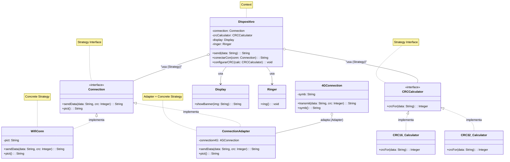

### UML dispositivos moviles y conexiones

```mermaid
classDiagram
    %% ==================== STRATEGY PARA CONEXIÓN ====================
    class Connection {
        <<interface>>
        +sendData(data: String, crc: Integer): String
        +pict(): String
    }
    
    class WifiConn {
        -pict: String
        +sendData(data: String, crc: Integer): String
        +pict(): String
    }
    
    class 4GConnection {
        -symb: String
        +transmit(data: String, crc: Integer): String
        +symb(): String
    }
    
    class ConnectionAdapter {
        -connection4G: 4GConnection
        +sendData(data: String, crc: Integer): String
        +pict(): String
    }
    
    %% ==================== STRATEGY PARA CRC ====================
    class CRCCalculator {
        <<interface>>
        +crcFor(data: String): Integer
    }
    
    class CRC16_Calculator {
        +crcFor(data: String): Integer
    }
    
    class CRC32_Calculator {
        +crcFor(data: String): Integer
    }
    
    %% ==================== DISPOSITIVO (CONTEXT) ====================
    class Dispositivo {
        -connection: Connection
        -crcCalculator: CRCCalculator
        -display: Display
        -ringer: Ringer
        +send(data: String): String
        +conectarCon(conn: Connection): String
        +configurarCRC(calc: CRCCalculator): void
    }
    
    %% ==================== OTRAS CLASES ====================
    class Display {
        +showBanner(img: String): String
    }
    
    class Ringer {
        +ring(): void
    }
    
    %% ==================== RELACIONES ====================
    Connection <|.. WifiConn : implementa
    Connection <|.. ConnectionAdapter : implementa
    4GConnection o-- ConnectionAdapter : adapta (Adapter)
    
    CRCCalculator <|.. CRC16_Calculator : implementa
    CRCCalculator <|.. CRC32_Calculator : implementa
    
    Dispositivo o-- Connection : "usa (Strategy)"
    Dispositivo o-- CRCCalculator : "usa (Strategy)"
    Dispositivo --> Display : usa
    Dispositivo --> Ringer : usa
    
    note for Connection "Strategy Interface"
    note for WifiConn "Concrete Strategy"
    note for ConnectionAdapter "Adapter + Concrete Strategy"
    note for CRCCalculator "Strategy Interface"
    note for Dispositivo "Context"
```

