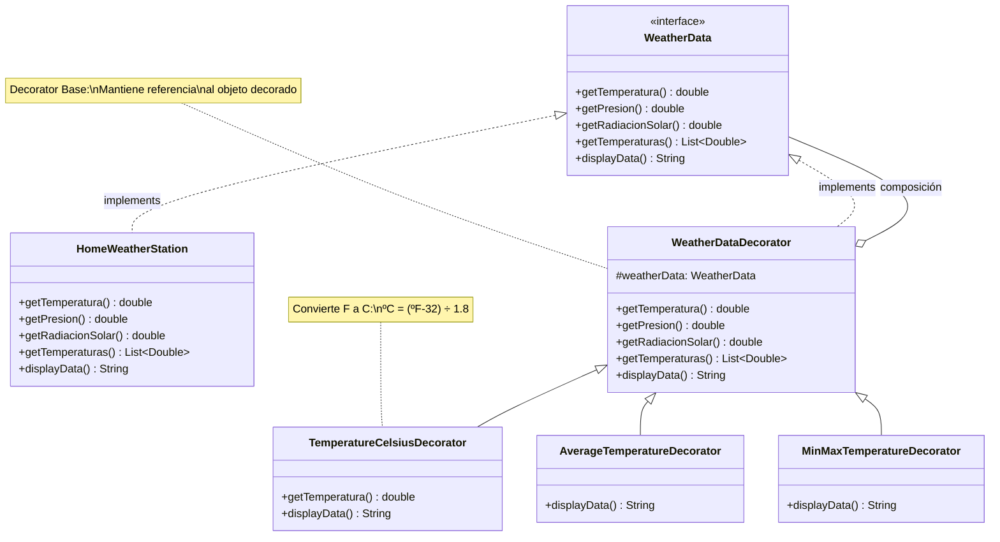

```table
| Elemento              | Rol                                | Clase                          |
|-----------------------|------------------------------------|--------------------------------|
| Component             | Interfaz base                      | `WeatherData`                  |
| Concrete Component    | Objeto original                    | `HomeWeatherStation`           |
| Decorator             | Base para decoradores              | `WeatherDataDecorator`         |
| Concrete Decorator    | Funcionalidad específica           | `TemperatureCelsiusDecorator`  |
| Concrete Decorator    | Funcionalidad específica           | `AverageTemperatureDecorator`  |
| Concrete Decorator    | Funcionalidad específica           | `MinMaxTemperatureDecorator`   |
```
