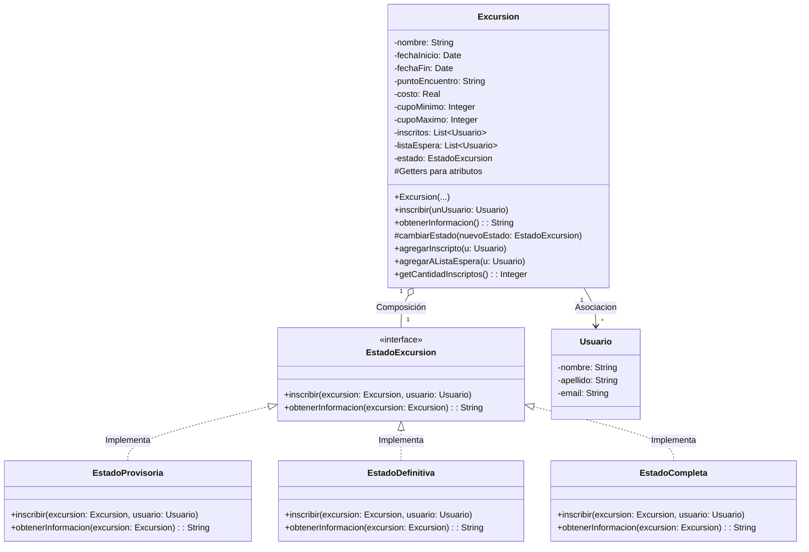

### UML de Excursiones 

```mermaid
classDiagram
    class Excursion {
        -nombre: String
        -fechaInicio: Date
        -fechaFin: Date
        -puntoEncuentro: String
        -costo: Real
        -cupoMinimo: Integer
        -cupoMaximo: Integer
        -inscritos: List~Usuario~
        -listaEspera: List~Usuario~
        -estado: EstadoExcursion
        +Excursion(...)
        +inscribir(unUsuario: Usuario)
        +obtenerInformacion(): String
        #cambiarEstado(nuevoEstado: EstadoExcursion)
        +agregarInscripto(u: Usuario)
        +agregarAListaEspera(u: Usuario)
        +getCantidadInscriptos(): Integer
        #Getters para atributos
    }

    class EstadoExcursion {
        <<interface>>
        +inscribir(excursion: Excursion, usuario: Usuario)
        +obtenerInformacion(excursion: Excursion): String
    }

    class EstadoProvisoria {
        +inscribir(excursion: Excursion, usuario: Usuario)
        +obtenerInformacion(excursion: Excursion): String
    }

    class EstadoDefinitiva {
        +inscribir(excursion: Excursion, usuario: Usuario)
        +obtenerInformacion(excursion: Excursion): String
    }

    class EstadoCompleta {
        +inscribir(excursion: Excursion, usuario: Usuario)
        +obtenerInformacion(excursion: Excursion): String
    }

    class Usuario {
        -nombre: String
        -apellido: String
        -email: String
    }

    Excursion "1" --> "*" Usuario : Asociacion
    Excursion "1" o-- "1" EstadoExcursion : Composición
    EstadoExcursion <|.. EstadoProvisoria : Implementa
    EstadoExcursion <|.. EstadoDefinitiva : Implementa
    EstadoExcursion <|.. EstadoCompleta : Implementa

```    
###

