### UML Juego de Roles

```mermaid
    classDiagram
    %% ==================== BUILDER ====================
    class PersonajeBuilder {
        <<interface>>
        +construirArmadura()
        +construirArma()
        +construirHabilidades()
        +getPersonaje(): Personaje
    }
    
    class GuerreroBuilder {
        +construirArmadura()
        +construirArma()
        +construirHabilidades()
        +getPersonaje(): Personaje
    }
    
    class ArqueroBuilder {
        +construirArmadura()
        +construirArma()
        +construirHabilidades()
        +getPersonaje(): Personaje
    }
    
    class MagoBuilder {
        +construirArmadura()
        +construirArma()
        +construirHabilidades()
        +getPersonaje(): Personaje
    }
    
    class ThoorBuilder {
        +construirArmadura()
        +construirArma()
        +construirHabilidades()
        +getPersonaje(): Personaje
    }
    
    %% ==================== FACTORY ====================
    class PersonajeFactory {
        <<abstract>>
        +crearPersonaje(nombre: String): Personaje
    }
    
    class PersonajeFactoryConcreta {
        +crearPersonaje(tipo: String, nombre: String): Personaje
    }
    
    %% ==================== PRODUCTO ====================
    class Personaje {
        -nombre: String
        -armadura: Armadura
        -arma: Arma
        -habilidades: List~Habilidad~
        -puntosVida: int
        +Personaje(nombre, armadura, arma, habilidades)
        +recibirAtaque(atacante: Personaje)
        +estaVivo(): boolean
        +getPuntosVida(): int
    }
    
    %% ==================== COMPONENTES ====================
    class Armadura {
        <<abstract>>
        #nombre: String
        +getNombre(): String
    }
    
    class ArmaduraDeCuero {
        +getNombre(): String
    }
    
    class ArmaduraDeHierro {
        +getNombre(): String
    }
    
    class ArmaduraDeAcero {
        +getNombre(): String
    }
    
    class Arma {
        <<abstract>>
        #nombre: String
        +calcularDano(armadura: Armadura): int
        +getNombre(): String
    }
    
    class Espada {
        +calcularDano(armadura: Armadura): int
        +getNombre(): String
    }
    
    class Arco {
        +calcularDano(armadura: Armadura): int
        +getNombre(): String
    }
    
    class Baston {
        +calcularDano(armadura: Armadura): int
        +getNombre(): String
    }
    
    class Martillo {
        +calcularDano(armadura: Armadura): int
        +getNombre(): String
    }
    
    class Habilidad {
        <<interface>>
        +usar(): String
    }
    
    class CombateCuerpoACuerpo {
        +usar(): String
    }
    
    class CombateDistancia {
        +usar(): String
    }
    
    class Curacion {
        +usar(): String
    }
    
    class Magia {
        +usar(): String
    }
    
    class LanzarRayos {
        +usar(): String
    }
    
    %% ==================== RELACIONES ====================
    PersonajeBuilder <|.. GuerreroBuilder : implementa
    PersonajeBuilder <|.. ArqueroBuilder : implementa
    PersonajeBuilder <|.. MagoBuilder : implementa
    PersonajeBuilder <|.. ThoorBuilder : implementa
    
    PersonajeFactory <|-- PersonajeFactoryConcreta : hereda
    
    Personaje o-- Armadura : composición
    Personaje o-- Arma : composición
    Personaje o-- Habilidad : composición
    
    Armadura <|-- ArmaduraDeCuero
    Armadura <|-- ArmaduraDeHierro
    Armadura <|-- ArmaduraDeAcero
    
    Arma <|-- Espada
    Arma <|-- Arco
    Arma <|-- Baston
    Arma <|-- Martillo
    
    Habilidad <|.. CombateCuerpoACuerpo : implementa
    Habilidad <|.. CombateDistancia : implementa
    Habilidad <|.. Curacion : implementa
    Habilidad <|.. Magia : implementa
    Habilidad <|.. LanzarRayos : implementa
    
    note for PersonajeBuilder "Builder Pattern"
    note for PersonajeFactory "Factory Method"
    note for Arma "Strategy Pattern (daño)"
    note for Habilidad "Strategy Pattern"
```



```jav
┌─────────────────────────────────────────────────┐
│                 CLIENTE                         │
│  factory.crearPersonaje("GUERRERO", "Aragorn")  │
└───────────────────┬─────────────────────────────┘
                    │
                    ▼
┌─────────────────────────────────────────────────┐
│              FACTORY (QUÉ)                      │
│  if (tipo == "GUERRERO")                        │
│     return new GuerreroBuilder().build()        │
└───────────────────┬─────────────────────────────┘
                    │
                    │ Delega
                    ▼
┌─────────────────────────────────────────────────┐
│              BUILDER (CÓMO)                     │
│  1. construirArmadura() → Acero                 │
│  2. construirArma() → Espada                    │
│  3. construirHabilidades() → Cuerpo a cuerpo    │
│  4. getPersonaje()                              │
└───────────────────┬─────────────────────────────┘
                    │
                    ▼
┌─────────────────────────────────────────────────┐
│            PERSONAJE CREADO                     │
│  Aragorn: Armadura=Acero, Arma=Espada           │
└─────────────────────────────────────────────────┘
```