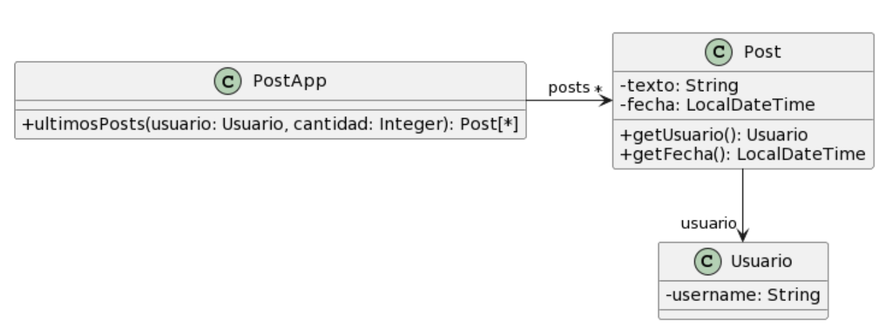

## Ejercicio 6: 

Para cada una de las siguientes situaciones, realice en forma iterativa los siguientes pasos:
(i) indique el mal olor,
(ii) indique el refactoring que lo corrige, 
(iii) aplique el refactoring, mostrando el resultado final (código y/o diseño según corresponda). 
Si vuelve a encontrar un mal olor, retorne al paso (i). 

## 6.1 Empleados

```java
public class EmpleadoTemporario {
    public String nombre;
    public String apellido;
    public double sueldoBasico = 0;
    public double horasTrabajadas = 0;
    public int cantidadHijos = 0;
    // ......
    
public double sueldo() {
return this.sueldoBasico
    +(this.horasTrabajadas * 500) 
    +(this.cantidadHijos * 1000) 
    -(this.sueldoBasico * 0.13);
}
}

public class EmpleadoPlanta {
    public String nombre;
    public String apellido;
    public double sueldoBasico = 0;
    public int cantidadHijos = 0;
    // ......
    
    public double sueldo() {
        return this.sueldoBasico 
            + (this.cantidadHijos * 2000) 
            - (this.sueldoBasico * 0.13);
    }
}

public class EmpleadoPasante {
    public String nombre;
    public String apellido;
    public double sueldoBasico = 0;
    // ......
    
    public double sueldo() {
        return this.sueldoBasico - (this.sueldoBasico * 0.13);
    }
}

```
### Malos Olores
Los Badsmells que se ven son:
"Encapsulate Field", todas las variables de instancia son publicas lo que rompe el encapsulamiento. 
Solucion: hacer "private" las variables y crear getters y setters
"Duplicate Code", tenemos tres clases de Empleados pudiendo tener solo una abstarcta y las demas ser subclases especializadas.
Solucion: hacer "Extract Superclass","Pull Up Method".

## Solucion: Encapsulate Field

```java
public class EmpleadoTemporario {
    private String nombre;
    private String apellido;
    private double sueldoBasico = 0;
    private double horasTrabajadas = 0;
    private int cantidadHijos = 0;
    // ......
    
    public double sueldo() {
        return this.sueldoBasico
            +(this.horasTrabajadas * 500) 
            +(this.cantidadHijos * 1000) 
            -(this.sueldoBasico * 0.13);
    }

    public String getNombre(){
        return this.nombre;
    }
    public String getApellido(){
        return this.apellido;
    }
    public double getSueldoBasico(){
        return this.sueldoBasico;
    }
    public double getHorasTrabajadas(){
        return this.horasTrabajadas;
    }
    public int getCantidadHijos(){
        return this.cantidadHijos;
    }
}

public class EmpleadoPlanta {
    private String nombre;
    private String apellido;
    private double sueldoBasico = 0;
    private int cantidadHijos = 0;
    // ......
    
    public double sueldo() {
        return this.sueldoBasico 
            + (this.cantidadHijos * 2000) 
            - (this.sueldoBasico * 0.13);
    }
    public String getNombre(){
        return this.nombre;
    }
    public String getApellido(){
        return this.apellido;
    }
    public double getSueldoBasico(){
        return this.sueldoBasico;
    }
    public int getCantidadHijos(){
        return this.cantidadHijos;
    }
}

public class EmpleadoPasante {
    private String nombre;
    private String apellido;
    private double sueldoBasico = 0;
    // ......
    
    public double sueldo() {
        return this.sueldoBasico - (this.sueldoBasico * 0.13);
    }
    public String getNombre(){
        return this.nombre;
    }
    public String getApellido(){
        return this.apellido;
    }
    public double getSueldoBasico(){
        return this.sueldoBasico;
}

```
## Solucion: Extract Superclass y Pull Up Method

```java
public abstract class Empleado(){
    private String nombre;
    private String apellido;
    private double sueldoBasico = 0;

    public Empleado(String nombre,String apellido, double sueldoBasico){
        this.nombre=nombre;
        this.apellido=apellido;
        this.sueldoBasico=sueldoBasico;
    }

    public String getNombre(){ return this.nombre;}
    public String getApellido(){return this.apellido;}
    public String getSueldoBasico{return this.sueldoBasico;}

    public abstract sueldo();
    }

    public class EmpleadoPasante {
        public EmpleadoPasante(String nombre,String apellido, double sueldoBasico){
            super(nombre,apellido,sueldoBasico);
        }
    
        public double sueldo() {
        return this.sueldoBasico - (this.sueldoBasico * 0.13);
        }
    }

public class EmpleadoPlanta {
    private int cantidadHijos = 0;
    
    public EmpleadoPasante(String nombre,String apellido, double sueldoBasico,double cantidadHijos){
        super(nombre,apellido,sueldoBasico);
        this.cantidadHijos=cantidadHijos;
    }
    
    public double sueldo() {
        return this.sueldoBasico 
            + (this.cantidadHijos * 2000) 
            - (this.sueldoBasico * 0.13);
    }
    
    public int getCantidadHijos(){
        return this.cantidadHijos;
    }
}

public class EmpleadoTemporario {
    private double horasTrabajadas = 0;
    private int cantidadHijos = 0;

    public EmpleadoPasante(String nombre,String apellido, double sueldoBasico,double cantidadHijos,
        int horasTrabajadas){
        super(nombre,apellido,sueldoBasico);
        this.cantidadHijos=cantidadHijos;
        this.horasTrabajadas=horasTrabajadas;
    }
    
    public double sueldo() {
        return this.sueldoBasico
            +(this.horasTrabajadas * 500) 
            +(this.cantidadHijos * 1000) 
            -(this.sueldoBasico * 0.13);
    }

    public double getHorasTrabajadas(){
        return this.horasTrabajadas;
    }
    public int getCantidadHijos(){
        return this.cantidadHijos;
    }
}

```
## 6.2 Juego

```java 
public class Juego {
    // ......
    public void incrementar(Jugador j) {
        j.puntuacion = j.puntuacion + 100;
    }
    public void decrementar(Jugador j) {
        j.puntuacion = j.puntuacion - 50;
    }

public class Jugador {
    public String nombre;
    public String apellido;
    public int puntuacion = 0;
}

}

```
### BadSmells
- Se puede ver en la clase Jugador que las variables de instancia son "public" lo cual rompe elencapsulamiento, asi que para solucionarlo se debera cambiar por "private", ademas se deberan hacer los getters de las mismas para poder accederlas.
- Otro BadSmell se ve en la clase Juego es "Feature Envy" o "Envidia de Atributo" esto es cuando una clase hace cosas que no le corresponden. En este caso los metodos incrementar() y decrementar() deberian estar en la clase Jugador, ya que es la que conoce los atributos. 
- Otro BadSmell es "Mistirius Name" en las variables "j", aca solamente se necesita cambiar "j" por "juagador".

```java 
public class Juego {
    // ......
    public void incrementar(Jugador jugador) {
        jugador.incrementar();
    }
    public void decrementar(Jugador jugador) {
        jugador.decrementar();
    }
}

public class Jugador {
    private String nombre;
    private String apellido;
    private int puntuacion = 0;

    public String getNombre(){return this.nombre};
    public String getApellido(){return this.apellido};
    public int getPuntuacion(){return this.puntuacion};
}

    public void incrementar() {
        this.puntuacion += 100;
    }
    public void decrementar() {
         this.puntuacion -= 50;
    }

```

## 6.3 Publicaciones


### Codigo a corregir
```java
/**
* Retorna los últimos N posts que no pertenecen al usuario user
*/
public List<Post> ultimosPosts(Usuario user, int cantidad) {
        
    List<Post> postsOtrosUsuarios = new ArrayList<Post>();
    for (Post post : this.posts) {
        if (!post.getUsuario().equals(user)) {
            postsOtrosUsuarios.add(post);
        }
    }
        
   // ordena los posts por fecha
   for (int i = 0; i < postsOtrosUsuarios.size(); i++) {
       int masNuevo = i;
       for(int j= i +1; j < postsOtrosUsuarios.size(); j++) {
           if (postsOtrosUsuarios.get(j).getFecha().isAfter(
     postsOtrosUsuarios.get(masNuevo).getFecha())) {
              masNuevo = j;
           }    
       }
      Post unPost = postsOtrosUsuarios.set(i,postsOtrosUsuarios.get(masNuevo));
      postsOtrosUsuarios.set(masNuevo, unPost);    
   }
        
    List<Post> ultimosPosts = new ArrayList<Post>();
    int index = 0;
    Iterator<Post> postIterator = postsOtrosUsuarios.iterator();
    while (postIterator.hasNext() &&  index < cantidad) {
        ultimosPosts.add(postIterator.next());
    }
    return ultimosPosts;
}
```
### Analisis
```
1. Long Method (Método Largo)
El método hace demasiadas cosas: filtra los posts, los ordena manualmente (con un algoritmo de selección) y luego corta la lista para devolver la cantidad pedida. En Refactoring, esto se soluciona con Extract Method.

2. Feature Envy (Envidia de Atributos)
Este es el smell más "uunlp" del código. El método ultimosPosts está constantemente pidiéndole cosas al objeto Post (post.getUsuario(), post.getFecha()) para tomar decisiones.

La lógica de comparación de fechas debería estar encapsulada o delegada a un comparador.

3. Inappropriate Intimacy (Intimidad Inapropiada)
El método conoce la estructura interna de la colección y cómo comparar los posts. Está demasiado acoplado a la clase Post.

4. Reinventing the Wheel (Reinventar la rueda)
Estás programando un algoritmo de ordenamiento a mano (for anidados con masNuevo = j). En Java moderno y en el contexto de la materia, esto es un smell de bajo nivel de abstracción.

Solución: Usar Collections.sort() o, mejor aún, Streams de Java 8+.

5. Comments (Comentarios)
Fijate que tenés comentarios como // ordena los posts por fecha. Según Fowler, si necesitás un comentario para explicar qué hace un bloque de código, es porque ese bloque debería ser un método con un nombr

### Refactorizamos
```
Replace Loop with Pipeline: Cambiamos los for y el Iterator por un Stream.

Extract Method (Implícito): Al usar el API de Streams, delegamos la lógica de ordenamiento y filtrado.
``

```java

public List<Post> ultimosPosts(Usuario user, int cantidad) {
    return this.posts.stream()
        .filter(post -> !post.getUsuario().equals(user)) // Filtro
        .sorted((p1, p2) -> p2.getFecha().compareTo(p1.getFecha())) // Ordeno(más nuevo primero)
        .limit(cantidad) // Corto la lista
        .collect(Collectors.toList());
}
``